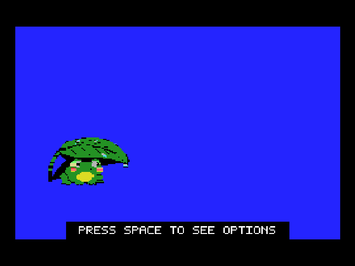

# 1983 - MSX / MSX2 emulator


1983 is a compatibility-focused MSX and MSX2 emulator written in C with SDL3.
It aims to run software for the first two generations of the MSX standard
without being tied to one manufacturer's machine.

It is the sibling project of
[1984](https://github.com/salvogendut/1984) (Amstrad CPC) and
[1985](https://github.com/salvogendut/1985) (Amstrad PCW), sharing their
window, overlay, keyboard, notification, LED, and configuration conventions,
and staying as multiplatform as SDL3 allows.

> **Status:** MSX1 and MSX2 firmware and cartridge software run, with
> TMS9918-family/V9938/V9958 video, AY/YM PSG audio, the international keyboard
> matrix, dual cartridge slots, expanded slots, memory mapper, RTC, and
> battery-backed CMOS. Native support covers catalogue-configured Philips
> WD2793 floppy controllers with raw MSX DSK images, the
> external Microsol CDX-2 and RDF600 cartridges, Sunrise IDE and MSX SCSI
> disks, and the SD Mapper V2 and MegaFlashROM
> SCC+ SD cartridges — the official Nextor kernels boot GeoBench and other
> media. An optional openMSXnet host bridge adds TCP/IP UNAPI under
> `UNAPINET.COM`. Protected floppy formats, cassette recording, MSX-MUSIC,
> and other extensions remain in development.

1983 has also been tested with original MSX and MSX2 BIOS images supplied by
users; those system ROMs are not redistributed by this project. The default
machine instead ships with the open-source, homebrew
[RainBIOS](https://github.com/salvogendut/rainbios) firmware.




*Sample outputs of the built-in GIF screen capture.*

## Features at a glance

- MSX, MSX2, and Philips NMS 8250 machine layouts with an editable
  `1983-models.conf` catalogue.
- Ready-to-run Omega MSX2 default powered by a redistributable 512 KiB
  RainBIOS unified ROM; C-BIOS remains available for MSX1.
- Linear, ASCII8/16, Konami, and Konami SCC cartridges.
- MSX1 screen/sprite modes plus selectable V9938/V9958 video on MSX2,
  including SCREEN 5-8, drawing commands, and V9958 YJK/YAE display support,
  plus initial PowerGraph V9990 cartridge video output.
- Cycle-timed AY-3-8910/YM2149 audio.
- Complete international MSX keyboard matrix, SDL3 joystick and mouse input.
- RP-5C01 clock with persistent per-machine CMOS and offline continuity.
- Sunrise IDE, NCR/Z5380 MSX SCSI, SD Mapper V2, MegaFlashROM SCC+ SD, and
  PowerGraph V9990 cartridges, with safe read-only/read-write raw images;
  the storage paths boot their matching Nextor or MSX-DOS firmware.
- Philips/CDX-2 WD2793 (including dual-ROM Angeisa/FAST! EPROM images) and
  RDF600/TDC-600-compatible TC8566AF floppy,
  CAS cassette playback, GIF capture, and an optional openMSXnet TCP/IP bridge.
- Headless execution plus deterministic component and firmware tests.

## Building

Requires a C11 compiler, GNU Autotools, `pkg-config`, SDL3 development files,
and `libm`. On Fedora:

```sh
sudo dnf install gcc make autoconf automake pkgconf-pkg-config SDL3-devel
autoreconf -iv
./configure
make -j4
make check
./1983
```

Tagged releases publish Linux x86_64, Fedora/RHEL RPM, Windows x86_64, macOS
(Apple Silicon and Intel), and x86_64 Flatpak artifacts on the
GitHub Releases page. See [`INSTALL.md`](INSTALL.md) for packaging details.

## Documentation

- [`USAGE.md`](USAGE.md) — machines, media, extensions, and quick start.
- [`CONTROLS.md`](CONTROLS.md) — keyboard, overlay, gamepad, and GIF controls.
- [`CONFIGURATION.md`](CONFIGURATION.md) — config files, RTC, and catalogue.
- [`SCSI.md`](SCSI.md) — MSX SCSI setup, BERT images, and DOS boot procedure.
- [`TECHNICAL.md`](TECHNICAL.md) — implemented hardware, timing, media, and
  frontend behavior.
- [`DEVELOPMENT.md`](DEVELOPMENT.md) — source layout, design boundaries, and
  verification.
- [`ROADMAP.md`](ROADMAP.md) — project goals and planned work.
- [`BOOT_TARGETS.md`](BOOT_TARGETS.md) — firmware lanes, checkpoints, Nextor
  target, and licensing.
- [`INSTALL.md`](INSTALL.md) — release assets and packaging notes.
- [`web/README.md`](web/README.md) — browser build, AUX extensions, media URLs,
  and the WebSocket UNAPI relay.

## Contributing

Hardware documentation, redistributable test programs, timing traces, and
well-described compatibility cases are welcome. Open an
issue before starting a substantial machine, device, or architecture change.

## License

1983 is released under the GNU General Public License version 2.0 only
(`GPL-2.0-only`). See [`LICENSE`](LICENSE). Redistributable firmware retained
under its own terms carries a notice beside the ROM; the bundled official
Nextor Sunrise ROM is covered by [`ROMS/LICENSE-NEXTOR`](ROMS/LICENSE-NEXTOR),
and the RainBIOS firmware provenance and notices are recorded in
[`ROMS/README-RainBIOS`](ROMS/README-RainBIOS).
