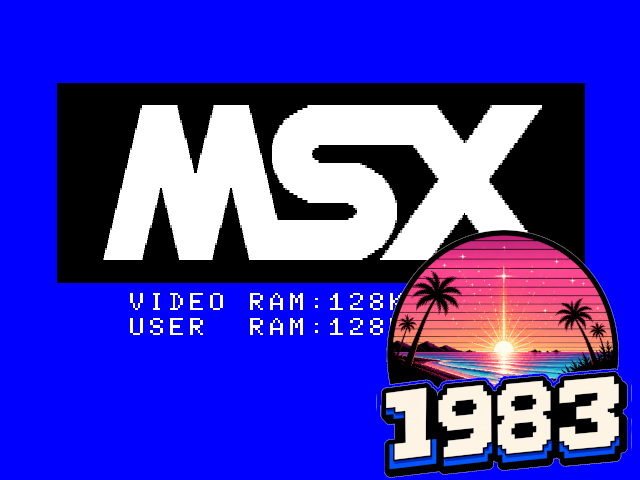
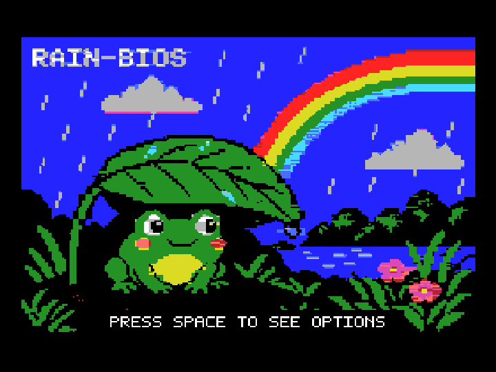

# 1983 - MSX / MSX2 emulator



1983 is a compatibility-focused MSX and MSX2 emulator written in C with
SDL3. It aims to run software for the first two generations of the MSX
standard without being tied to one manufacturer's machine.

It is the sibling project of
[1984](https://github.com/salvogendut/1984), the Amstrad CPC emulator, and
[1985](https://github.com/salvogendut/1985), the Amstrad PCW emulator. It
shares their window, overlay, keyboard shortcut, notification, LED, and
configuration conventions, and is intended to remain as multiplatform as
SDL3 allows.

> **Status:** MSX1 and MSX2 firmware and cartridge software are running.
> The emulator includes TMS9918-family and V9938 video, AY/YM PSG audio,
> the international keyboard matrix, SDL3 joystick input, dual cartridge
> slots with common mappers, MSX2 expanded slots, memory mapper, RTC, and
> battery-backed per-machine CMOS, plus native Philips WD2793 floppy
> support with safe read-only/read-write raw
> DSK images, safe read-only/read-write Sunrise IDE disks, and the composite
> MSX SD Mapper V2 and MegaFlashROM SCC+ SD cartridges. Both provide two SD
> cards and an independent 512 KiB mapper; MegaFlashROM additionally provides
> persistent 8 MiB flash, SCC-I, and a cartridge PSG. The
> official Sunrise Nextor kernel can boot the GeoBench raw image to its
> desktop, while the official SD Mapper V2 ROM boots both Nextor system
> media and the GeoBench image from SD. The official MegaFlashROM preflash
> also boots its Nextor 2.10 ROM disk to the command prompt. An optional
> openMSXnet-compatible host bridge lets the unmodified `UNAPINET.COM` TSR
> provide TCP/IP UNAPI 1.1 to GeoBench, SymbOS, and other MSX software.
> Standard MSX CAS cassette playback
> is integrated with the BIOS motor and input path. Protected floppy
> formats, cassette recording, MSX-MUSIC audio, and other extensions remain in
> development.

## Highlights

- MSX, MSX2, and Philips NMS 8250 machine layouts.
- Editable `1983-models.conf` machine and firmware catalogue.
- Linear, ASCII8, ASCII16, Konami, and Konami SCC cartridges.
- MSX1 screen and sprite modes plus V9938 SCREEN 5 through SCREEN 8,
  sprite mode 2, drawing commands, interrupts, and timed VRAM access.
- Cycle-timed AY-3-8910/YM2149 audio through SDL3.
- Complete international MSX keyboard matrix.
- RP-5C01-compatible MSX2 clock with per-machine persistent CMOS and
  offline clock continuity.
- Familiar F9 overlay, function-key controls, status LEDs, notifications,
  screenshots, fullscreen, and integer scaling.
- Cartridge I/II presence LEDs, with a split network-access form.
- Sunrise IDE cartridge emulation, explicit read-only/read-write raw ATA
  images, safe flush/ejection, IDE activity, and Nextor boot.
- MSX SD Mapper V2 emulation with its expanded cartridge slot, two SPI SD
  cards, switchable 512 KiB mapper, safe writable images, and Nextor boot.
- MegaFlashROM SCC+ SD emulation with four expanded subslots, persistent
  M29W640GB flash, all hardware mapper modes, dual MegaSD cards, a 512 KiB
  mapper, SCC-I and cartridge PSG audio, and safe writable storage.
- Philips NMS 8250 WD2793 emulation, conventional raw DSK images, safe
  sector writes, optional second floppy, and independent activity LEDs.
- Standard MSX CAS playback with emulated motor control, transport status,
  rewind/eject controls, and the Tape LED.
- openMSXnet v0.9.7-compatible TCP/IP UNAPI bridge with asynchronous DNS,
  active/passive TCP, UDP, reset-safe socket lifetime, and network activity.
- Headless execution and deterministic component and firmware tests.



*Sample output of the built-in GIF screen capture.*

The detailed implementation and remaining limitations are recorded in
[`TECHNICAL.md`](TECHNICAL.md).

## Building

1983 requires a C11 compiler, GNU Autotools, `pkg-config`, SDL3 development
files, and `libm`. On Fedora:

```sh
sudo dnf install gcc make autoconf automake pkgconf-pkg-config SDL3-devel
```

Build, test, and run:

```sh
autoreconf -iv
./configure
make -j4
make check
./1983
```

Fresh configurations select the bundled `cbios` model, a basic generic MSX1
machine using the included C-BIOS main and logo ROMs. The resulting
per-user `1983.conf` records that complete firmware choice automatically.

Useful options:

```sh
./1983 --model msx2 --region pal
./1983 --cart ROMS/game.rom
./1983 --models ./my-models.conf --model my-msx
./1983 --model msx1 --cassette /path/to/program.cas
./1983 --model nms8250 --disk-a /path/to/game.dsk \
  --floppy-mode read-only
./1983 --sunrise-rom /path/to/Nextor.SunriseIDE.ROM \
  --ide /path/to/disk.img --ide-mode read-only
./1983 --model msx1 --sd-mapper-rom /path/to/SDXC110.ROM \
  --sd-a /path/to/card.img --sd-mode read-only
./1983 --model msx1 --megaflash-rom /path/to/megaflash-8m.rom \
  --megaflash-sd-a /path/to/card.img --sd-mode read-only
./1983 --model nms8250 --unapi
./1983 --config ./test.conf
./1983 --headless --unthrottled --exit-after 10
./1983 --gif-out demo.gif --exit-after 120
./1983 --help
```

Tagged releases publish a portable Linux x86_64 bundle, a Fedora/RHEL-family
RPM, a Windows x86_64 ZIP, macOS application bundles for Apple Silicon and
Intel, and an x86_64 Flatpak bundle on the
[GitHub Releases page](https://github.com/salvogendut/1983/releases).
See [`INSTALL.md`](INSTALL.md) for installation and package-building details.

## Firmware and machines

1983 bundles the redistributable C-BIOS 0.29 MSX1 firmware so cartridge
software has a ready-to-use boot target. Other system ROMs and cartridges
are not distributed; place copies you are entitled to use in the
Git-ignored `ROMS/` directory, or point the machine catalogue at another
private location.

[`1983-models.conf`](1983-models.conf) initially defines:

- `cbios` — C-BIOS MSX, using the bundled main and logo ROMs;
- `msx1` — MSX with a 32 KiB BIOS;
- `msx2` — MSX2 with a BIOS and Sub-ROM;
- `nms8250` — Philips NMS 8250 with BIOS, Sub-ROM, and disk ROM.

Open the F9 overlay and select **General > Machine**. Complete catalogue
mappings load directly and exactly as defined, without opening firmware file
pickers. The whole firmware set is validated before replacing the running
machine; missing or invalid required firmware leaves it unchanged.

To add another model using an implemented hardware layout, copy a catalogue
section, give it a unique ID and name, and change its firmware paths. Paths
may be absolute or relative to the catalogue file. Blank optional firmware
fields leave those components disconnected.

For graphical editing, enable **General > Tinker**, then open
**Advanced > Machine model editor**. It can add, edit, duplicate, and delete
models; choose firmware files; validate IDs and ROM sizes; and atomically
save the complete catalogue to the user configuration directory. Select the
edited model under **General > Machine** to apply it. Machine composition is
performed only in this editor.

C-BIOS can also be started explicitly:

```sh
./1983 --region ntsc \
  --bios ROMS/cbios_main_msx1.rom \
  --logo ROMS/cbios_logo_msx1.rom \
  --cart /path/to/game.rom
```

With the default local mappings and user-supplied ROMs, start the NMS 8250
with:

```sh
./1983 --model nms8250 --region pal
```

See [`BOOT_TARGETS.md`](BOOT_TARGETS.md) for firmware setup, diagnostic
checkpoints, the GeoBench/Nextor target, and licensing boundaries.

## Controls

| Key | Action |
|-----|--------|
| F4 | Save a PPM screenshot |
| F5 | Reset |
| F6 | Start or stop animated GIF recording |
| F8 | Monitor/disassembler placeholder |
| F9 | Open or save and close the options overlay |
| F11 | Toggle fullscreen |
| F12 | Quit |
| Pause | Pause or resume |
| Ctrl++ / Ctrl+- | Change window scale |
| Ctrl+V | Paste host clipboard text into the MSX |
| Shift+F1…F5 | Send MSX F1…F5 |
| Shift+F7 / Shift+F8 | Send MSX SELECT / STOP |
| Click in window | Capture the mouse when the selected port is Mouse |
| Ctrl+Enter | Release captured mouse input |

Press **F6** to start or stop animated GIF recording, or pass `--gif-out PATH` on
the command line to capture on startup. The **Advanced** overlay section cycles
the capture resolution (720/540/360/240/180), frame rate (25/20/10/5 fps), and
encoder (built-in GIF89a or FFmpeg optimize).

Inside the overlay, Left and Right change section, Up and Down select a row,
Enter activates it, F9 saves, and Escape closes or offers to discard changes.
In Extensions, Enter enables or disables a device, Space edits configurable
device settings, and Delete clears those saved settings.
PSG volume now lives in General, whose RAM control cycles through supported
sizes up to 4096 KiB. Main Input selects Joy Port A or B, and the two port
entries select Joystick or Mouse for each connector. These selections are
persisted. The primary SDL3 gamepad drives the selected connector when that
port is set to Joystick: the D-pad or left stick provides direction, while
the south and east face buttons provide triggers A and B. Gamepads may be
connected or removed while 1983 is running. When the selected Main Input
connector is set to Mouse, click the emulator window to capture relative host
movement. The left and right host buttons become MSX buttons A and B.
Ctrl+Enter, F9, reset, or losing window focus releases capture.

Ctrl+V types the host clipboard into the emulated international MSX keyboard
matrix. Letters, digits, common punctuation, tabs, and line breaks are sent
one key at a time; clipboard text is reproduced verbatim without appending an
extra Return.

**General > Extra Hardware** reveals Extensions; **General > Tinker**
reveals Advanced.

**Extensions > MSX TCP/IP UNAPI** enables the host network bridge. It is a
port-mapped device and does not occupy either cartridge slot. Guest software
must first run openMSXnet v0.9.7's separate `UNAPINET.COM` TSR under Nextor
or MSX-DOS 2; 1983 does not bundle that third-party binary. Network traffic
pulses the white network LED. The Extensions row reports `On (awaiting TSR)`
until the guest driver detects the bridge, then changes to `On (TSR active)`.
See [`BOOT_TARGETS.md`](BOOT_TARGETS.md) for driver installation and the
GeoBench setup.

MSX2 machines keep their battery-backed clock and CMOS settings in a
per-machine file under the configuration directory's `rtc/` folder. With
Tinker enabled, **Advanced > RTC persistence** can disable this behavior.
It is enabled by default. Reset preserves CMOS, a guest-stopped clock does
not gain time while 1983 is closed, and invalid files are ignored with a
visible warning before a later atomic save repairs them.

On a Philips NMS 8250, **Media > Floppy A** inserts a conventional raw
`.dsk` image. Delete safely ejects it. With Tinker enabled,
**Advanced > Floppy access mode** explicitly selects read-only or read/write;
read-only is the default. **Extensions > Second floppy** adds an independently
selectable **Floppy B** row to Media and enables its activity LED. Completed
sector writes are flushed on replacement, ejection, and shutdown. Reset
discards only an incomplete sector transfer and preserves mounted media.
Host I/O failures remain visible and block unsafe ejection. Command-line
equivalents are `--disk-a`, `--disk-b`, and `--floppy-mode`.
The current backend accepts conventional raw 320, 360, 640, and 720 KiB
sector images. Extended DSK, protected, and flux-level formats are not yet
supported.

**Media > Cassette** inserts a standard `.cas` image and rewinds it. The
row shows its type, transport state, and elapsed/total time. Press R on that
row to rewind and Delete to eject. Playback advances only while guest
software turns on the cassette motor; the Tape LED follows that signal.
1983 also identifies the appropriate BIOS command: use `RUN"CAS:"` for an
ASCII tape, `BLOAD"CAS:",R` for a binary tape, or `CLOAD` followed by plain
`RUN` for a tokenized BASIC tape. Rewind before trying a different command
after an unsuccessful load, because the first attempt may have consumed
part of the stream.

With Tinker enabled, Advanced provides independent Tape Audio Monitor and
Tape Visual Monitor toggles. The audio monitor mixes the data tone with PSG
output. The translucent visual scope appears while the tape motor is running
and shows the waveform, detected type, required command, and elapsed/total
time. Recording and sampled audio formats are not implemented yet.

Sunrise IDE, SD Mapper V2, MegaFlashROM SCC+ SD, SCC, and MSX-MUSIC are
cartridge-connected
extensions. The
first configured device reserves cartridge slot 2 and the second reserves
slot 1. Reserved cartridge and mapper controls remain visible but cannot be
used. The first activation of **Extensions > Sunrise IDE** opens a small
setup panel: select the required 128 KiB Sunrise/Nextor controller ROM,
optionally select a raw IDE image, then Connect. New images start read-only.
Later Enter presses disconnect or reconnect the configured controller. Space
reopens its prepopulated setup panel; applying changes to a live controller
reconnects it only after the replacement firmware and media are ready. Delete
disconnects it safely and clears its stored controller and disk settings. The
IDE hard-disk row appears
in Media only while Sunrise IDE is connected and owns subsequent image
changes and safe ejection. With Tinker enabled, **Advanced > IDE access
mode** explicitly switches the attached image between read-only and
read/write. Images must use complete 512-byte sectors. Read-only is the
default.
Dirty data is flushed for ATA FLUSH CACHE, image replacement, ejection, and
shutdown. A host I/O failure is reported and blocks ejection/replacement so
it cannot silently discard buffered data. Keep backups of writable images:
host filesystems cannot guarantee sector-level atomicity after power loss.

The first activation of **Extensions > SD Mapper V2** opens its own setup
panel. Select the required 128 or 256 KiB controller ROM, optionally attach
SD Card A and SD Card B images, choose whether the cartridge's 512 KiB mapper
is enabled, and Connect. One physical cartridge slot is reserved even though
the device exposes an expanded slot internally: controller ROM and SD
registers occupy subslot 0, while mapper RAM occupies subslot 1. Media owns
later card insertion and safe ejection. With Tinker enabled, Advanced
provides **SD access mode**, **SD Mapper 512K RAM**, and the primary/alternate
driver switch. Two green SD A/B LEDs report card traffic. Command-line
equivalents are `--sd-mapper-rom`, `--sd-a`, `--sd-b`, and `--sd-mode`.
Controller ROMs and card contents are user-supplied and are never bundled.
Space on the extension reopens all of these settings without toggling it;
Delete safely disconnects it and clears the saved ROM, cards, and switches.

**Extensions > MegaFlashROM** configures the composite MegaFlashROM SCC+ SD
cartridge. Its setup keeps three different things distinct: an initial flash
image up to 8 MiB, removable SD Card A, and removable SD Card B. The initial
dump seeds a private writable flash state under the active configuration
directory's `flash/` folder; guest flash programming never modifies the
source dump. Subsequent starts load that private state. The emulated cartridge
contains the recovery subslot, multi-mapper MegaFlash subslot, independent
512 KiB mapper, MegaSD subslot, SCC-I, and cartridge PSG. Later SD insertion
and safe ejection live under Media and use the same Advanced > SD access mode
as SD Mapper V2. The SD A/B LEDs report traffic, while the owning cartridge
LED remains orange. Command-line equivalents are `--megaflash-rom`,
`--megaflash-sd-a`, `--megaflash-sd-b`, and `--sd-mode`. The required initial
dump, flashed software, and SD contents are user-supplied and never bundled.
Space reopens the prepopulated setup, while Delete safely disconnects the
extension and clears its saved initial-image and card settings. Selecting a
different initial image reseeds the private flash state atomically.
The official [`mfrsd.rom` preflash](https://www.msxcartridgeshop.com/bin/mfrsd.zip)
is accepted at its native 8,208,384-byte length and its remaining erased
flash area is padded automatically.

SDL scancodes map positionally to the international MSX keyboard. Left Ctrl
is CTRL, left Alt is GRAPH, right Alt is CODE, and right Ctrl is the ACC/dead
key. Both Shift keys, editing keys, arrows, and the numeric keypad are
supported.

## Configuration

User settings are stored in `~/.config/1983/1983.conf` on Unix-like systems
and in the application-data directory on Windows. Use `--config PATH` for an
isolated configuration; [`1983.conf.example`](1983.conf.example) documents
the available settings. RTC files follow the selected configuration file,
so isolated configurations also get isolated clocks. On Unix,
`--config /dev/null` deliberately disables RTC persistence for disposable,
deterministic runs.

1983 searches for `1983-models.conf` in the user configuration directory,
the current directory, and the installed application-data directory.
`--models PATH` selects a different catalogue. The graphical editor always
writes a per-user catalogue, seeding it with the complete active catalogue
on the first saved edit so installed or repository copies remain untouched.

The local `DOS/` directory is reserved for guest DOS files. Its contents,
including `NEXTOR.SYS`, are ignored and are not distributed with 1983.

## Documentation

- [`TECHNICAL.md`](TECHNICAL.md) — implemented hardware, timing, media, and
  frontend behavior.
- [`DEVELOPMENT.md`](DEVELOPMENT.md) — source layout, design boundaries,
  hardware notes, and verification.
- [`ROADMAP.md`](ROADMAP.md) — project goals, support matrix, and planned
  work.
- [`BOOT_TARGETS.md`](BOOT_TARGETS.md) — firmware lanes, reproducible
  checkpoints, Nextor target, and licensing.
- [`INSTALL.md`](INSTALL.md) — release assets, source installation, RPM,
  Flatpak, Windows, and macOS notes.

## Contributing

Hardware documentation, redistributable test programs, timing traces, and
well-described compatibility cases are welcome. Please use the
[issue tracker](https://github.com/salvogendut/1983/issues) before starting a
substantial machine, device, or architecture change.

## License

1983 is released under the GNU General Public License version 2.0 only
(`GPL-2.0-only`). See [`LICENSE`](LICENSE).
